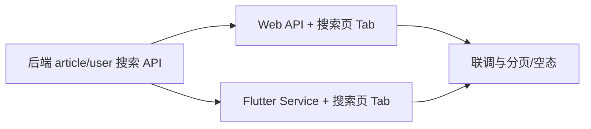

# 文章与 UP 主搜索 — 实现规划

本文档约定 **专栏（文章）** 与 **用户（UP）** 搜索的后端、Web、App 实现路径，并与现有 **视频搜索**（`SearchVideo`）对齐。

---

## 1. 现状对照

| 能力 | 后端 | Web (`web-client`) | App (`alnitak_flutter`) |
|------|------|-------------------|-------------------------|
| 视频搜索 | ✅ `POST /api/v1/video/searchVideo` | ✅ `pages/search/[keywords].vue` | ✅ `search_page.dart` |
| 文章搜索 | ❌ | ❌ | ❌（首页文案含「专栏」但无接口） |
| UP 搜索 | ❌ | ❌ | ❌（占位文案「UP主」） |

**视频搜索参考实现**：`dto.SearchVideoReq` → `service.SearchVideo`（`title`/`tags` `LIKE`，`status = AUDIT_APPROVED`，分页 `Pluck` id 再组装 `VideoResp`）。

---

## 2. 目标与非目标

**目标（MVP）**

- 公开接口、无需登录；关键词 + 分页；仅返回 **已审核通过** 的文章与 **状态正常** 的用户。
- 与现有视频搜索相同的分页上限习惯（如 `pageSize ≤ 30`）。
- Web、App 在搜索页支持 **视频 / 专栏 / UP**（Tab 或等价交互），共用同一套后端契约。

**非目标（后续迭代）**

- 全文检索引擎（ES/OpenSearch/Meilisearch）、拼音、纠错、搜索建议、热榜合并进搜索。
- 复杂相关性打分（MVP 可用 `ORDER BY id DESC` 或 `clicks DESC` 简单排序，见 3.3）。

---

## 3. 后端（Go）

### 3.1 请求模型（建议独立 DTO，与视频字段对齐）

新建或扩展 `internal/domain/dto/search.go`（或分别放在 `article.go` / 用户相关 dto）：

```go
// 建议为搜索类请求统一加 json tag，避免与前端字段不一致
type SearchArticleReq struct {
    Page     int    `json:"page"`
    PageSize int    `json:"pageSize"`
    KeyWords string `json:"keywords"` // Web SearchVideoType 使用 keywords；Flutter 视频搜索现用 keyWords，新接口可同时兼容见下
}
```

**字段名约定**：当前 `SearchVideoReq` 的 Go 字段为 `KeyWords` 且无 `json` tag，Web 发 `keywords`、App 发 `keyWords`，依赖绑定行为易出现隐蔽问题。**新接口强烈建议**统一为 `json:"keywords"`，并在 Flutter 新请求体中改为 **`keywords`**，与 Web 一致；若暂时保留 App 的 `keyWords`，可在 Handler 里做一次别名合并或在 DTO 上增加 `json:"keywords"` + 兼容 `form`。

`Search-user` 与 `SearchArticle` 两个 struct 字段保持一致即可。

校验：`Bind` 后校验 `page`、`pageSize`（上限 30）；`KeyWords` 做 `TrimSpace`，**可选**限制最大长度（如 100）防滥用。

### 3.2 文章搜索服务

**文件**：`internal/service/article.go`（或 `search.go` 内调用 article 私有逻辑）

**逻辑**（对齐 `SearchVideo`）：

1. `keywords == ""`：可返回「最新已通过文章」分页（与 `SearchVideo` 空关键词行为一致），或返回空列表（产品二选一，**建议与视频一致：都给默认列表**）。
2. `keywords != ""`：`keywords = "%" + kw + "%"`  
   **WHERE**：`status = global.AUDIT_APPROVED`  
   **AND**：`title LIKE ? OR tags LIKE ? OR content_desc LIKE ?`  
   （**不要**对 `content` 长文本做 `LIKE`，避免慢查询与 IO；若强需求全文再上单列前缀索引或 ES。）
3. `Pluck("id", &ids)` → 对每个 id 调用现有 **`GetArticleItemInfo(id)`**（已含 `Author`、列表字段），并 **`Clicks += GetArticleClicks(id)`**（与随机列表一致）。

**API**：`internal/api/v1/article.go`  
**路由**：`internal/routes/article_router.go` 在 **公开** `articleGroup` 上增加，例如：

- `POST article/searchArticle`（与 `searchVideo` 同为 POST + JSON，前端统一封装）

**响应**：`resp.OkWithData(ctx, gin.H{"articles": articles})`，元素类型为 `[]vo.ArticleResp`（与现有文章列表一致，减少前端类型映射）。

### 3.3 用户（UP）搜索服务

**文件**：`internal/service/user.go`（或独立 `search_user.go`）

**逻辑**：

1. 仅 **`status = 0`（正常）**；尊重 Gorm **`deleted_at IS NULL`**（若启软删）。
2. 关键词匹配：`username LIKE ? OR sign LIKE ?`（签名可为空，无妨）。
3. **禁止**在搜索结果中返回 `email`、`password` 等敏感字段；仅组装 **`GetUserBaseInfo(uid)`** 或现有 **`UserInfoResp`** 公开结构。
4. 分页：`Pluck` id 或 直接 `Limit/Offset` 后逐条 `GetUserBaseInfo`。

**API**：`internal/api/v1/user.go`  
**路由**：在 **公开** `userGroup` 增加：

- `POST user/searchUser`（或 `GET` + query，为与视频/文章统一 **推荐 POST + JSON**）

**响应**：`gin.H{"users": []vo.UserInfoResp}`（字段与 `getUserBaseInfo` 一致）。

### 3.4 安全与运维（MVP 必做项）

- 与视频接口相同的 **`pageSize` 上限**。
- 关键词长度、空字符串策略统一。
- **可选**：中间件按 IP 限流（第二阶段）。

### 3.5 第二阶段（可选）

- MySQL：**`title`/`username` 前缀索引** 或 **FULLTEXT**（中文需 ngram）。
- 引入独立搜索引擎；同步由 Binlog/定时任务/双写。

---

## 4. Web（Nuxt `web-client`）

### 4.1 API 封装

- `src/api/article.ts`：`searchArticleAPI(data)` → `POST v1/article/searchArticle`
- `src/api/user.ts`：`searchUserAPI(data)` → `POST v1/user/searchUser`  
请求体类型可与 `SearchVideoType` 同形：`{ page, pageSize, keywords }`（注意后端 json tag 与现有 `SearchVideoReq` 一致：**KeyWords** 若后端用 `binding` 需确认字段名；当前视频用 `Bind` 与结构体字段名，查 `SearchVideo` 请求体命名）。

**注意**：核对现有 `SearchVideoReq` 的 JSON 字段名（若为 `keywords` 小写，新接口保持统一）。

### 4.2 搜索页改造

**文件**：`src/pages/search/[keywords].vue`（或升级为 `search/index.vue` + query，减少路由编码问题）

**交互**：

- Tab：**视频 | 专栏 | UP主**。
- 每个 Tab 独立 `page` / `loading` / `noMore`，**懒加载滚动**逻辑与当前视频一致。
- 专栏列表：复用文章卡片组件（如 `article/list` 或详情列表用到的卡片样式）。
- UP 列表：头像 + 昵称 + 签名，链接至 `/user/[id]`。

首屏可从 `route.params.keywords` 初始化三 Tab 的关键词（与现逻辑一致）。

### 4.3 入口

- `home-header` / `header-bar` 搜索跳转：确认带上当前 Tab 或默认「视频」均可（MVP 可先仍进综合搜索页默认「视频」Tab）。

---

## 5. App（Flutter `alnitak_flutter`）

### 5.1 API 层

- `ArticleApiService`（或新建）：`searchArticle(keywords, page, pageSize)`。
- `UserApiService`：`searchUser(...)`。  
与 `VideoApiService.searchVideo` 同一 `baseUrl`、错误处理风格。

### 5.2 UI

**文件**：`lib/pages/search_page.dart`（建议改为 `DefaultTabController` 三 Tab）

- Tab1：现有视频列表（逻辑保留）。
- Tab2：文章列表（新 Widget，模型可对照 Web `ArticleResp` / 现有文章模型）。
- Tab3：用户列表（`UserBaseInfo` 或现有用户信息模型）。

滚动加载：各 Tab 独立页码与 `_hasMore`。

### 5.3 文案

- 占位符与 Tab 名称一致，避免「UP主」无结果却走视频接口的语义错误。

---

## 6. 实施顺序（建议）



1. **后端**：DTO → `service` → `api` → **公开路由** → 本地 Postman/curl 验收。  
2. **Web**：API + 搜索页 Tab + 空态/错误提示。  
3. **Flutter**：API + Tab + 列表组件。  
4. **回归**：原视频搜索、文章详情、用户主页跳转。

---

## 7. 测试清单

- 无关键词 / 有关键词 / 超长短语 / 特殊字符（含 `%`、`_` 转义若需要）。  
- 仅已通过文章、已封禁用户不出现；软删用户不出现。  
- 分页：`pageSize` 边界、最后一页 `hasMore`。  
- Web/App 切换 Tab 不换丢搜索词；刷新页面关键词仍在（Web）。  
- 与现有鉴权无关：**未登录可搜**。

---

## 8. 文档与配置

- 后端若有 OpenAPI/Apifox，补两条新接口说明。  
- 本文档路径：`web/web-client/docs/search/implementation-plan.md`（规划跨三端，以 Web 仓库存档；若后端单仓也有 `docs/`，可复制链接互指）。

---

*规划版本：与当前仓库结构一致（2025-03）；实施时以实际 `dto` 字段名与 JSON tag 为准做一次对齐检查。*

---

## 9. 已落地（实施记录）

- **后端**：`POST /api/v1/article/searchArticle`、`POST /api/v1/user/searchUser`；`dto/search.go`；`service/article.go` · `SearchArticle`，`service/user.go` · `SearchUser`；`SearchVideoReq` 已补 `json:"keywords"` 与 Web 一致。
- **Web**：`src/api/article.ts` · `searchArticleAPI`，`src/api/user.ts` · `searchUserAPI`；`src/typings/search.d.ts`；`pages/search/[keywords].vue` · 视频/专栏/UP Tab。
- **Flutter**：`ArticleApiService.searchArticles`、`UserService.searchUsers`；`VideoApiService` 请求体改为 `keywords`；`search_page.dart` · TabBar + 三列表；`UserBaseInfo` 增加可选 `fans`。

后续可迭代：MySQL `LIKE` 转义、`ORDER BY` 权重、独立搜索引擎与限流（见前文非目标）。
